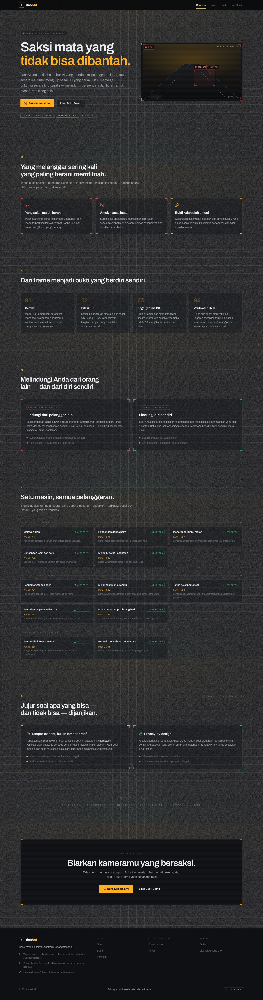
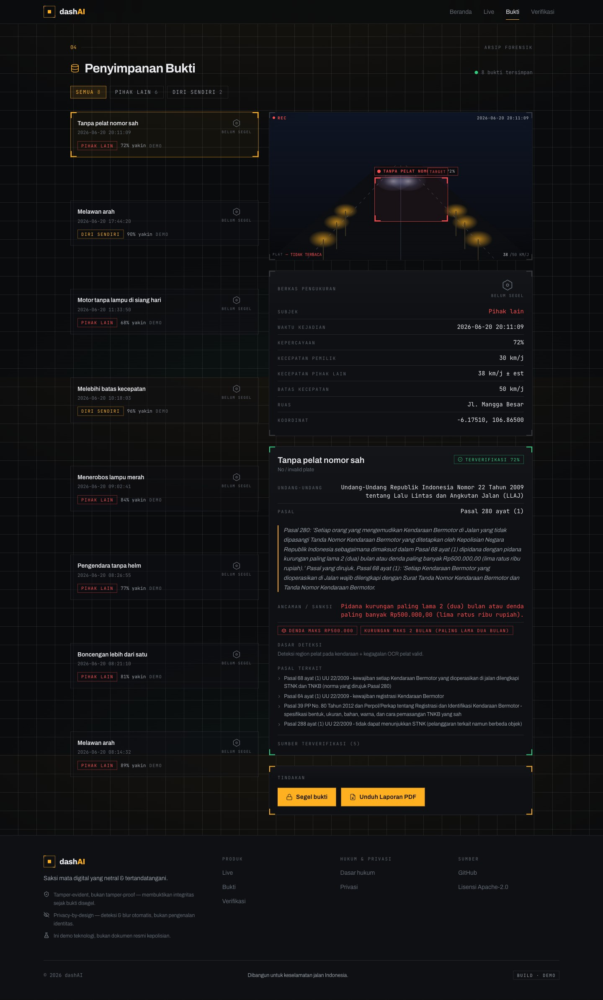
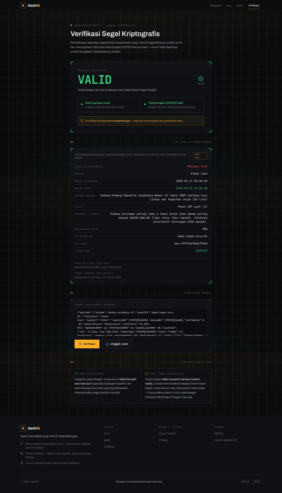
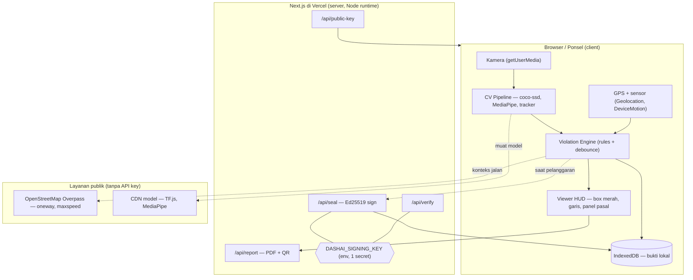
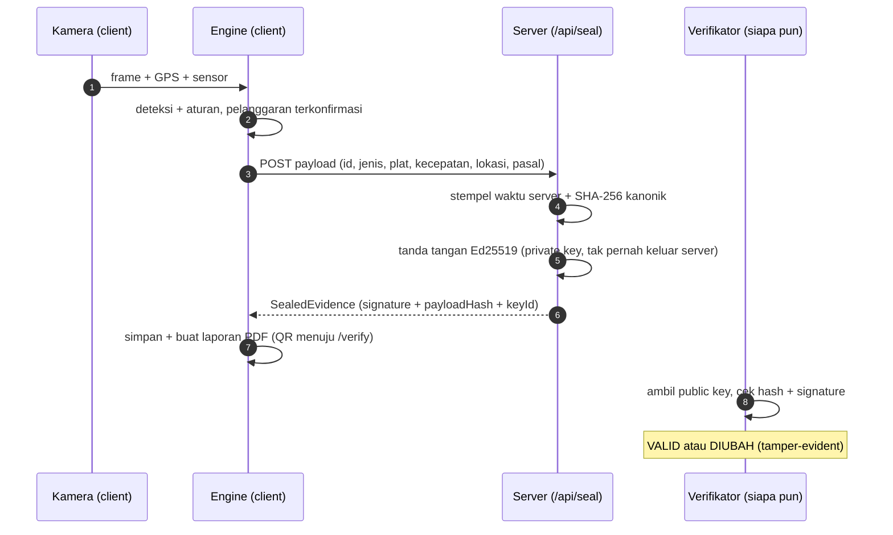

<div align="center">

# dashAI

### Saksi mata digital yang netral & tertandatangani

**AI dashcam yang mendeteksi pelanggaran lalu lintas secara real-time, mengutip UU LLAJ, dan menyegel bukti secara kriptografis — untuk melindungi pengendara dari fitnah, tilang palsu, dan amuk massa.**

[](./LICENSE)
[](https://nextjs.org)
[](https://www.typescriptlang.org)
[](#-tamper-evidence-jujur-soal-apa-yang-bisa-dijanjikan)

### → [**Coba demo langsung: dashai-mu.vercel.app**](https://dashai-mu.vercel.app) ←

</div>

---

## Kenapa dashAI ada

Di Indonesia, masalahnya nyata: **yang melanggar sering kali yang paling berani memfitnah.** Mobil menabrak motor yang melawan arah; si pelanggar marah duluan, memicu kerumunan, dan kesenjangan ekonomi dipakai jadi bensin — bukti objektif kalah oleh emosi massa. ETLE statis tidak ada di setiap sudut jalan.

dashAI mengubah setiap ponsel/dashcam menjadi **saksi mata digital yang netral**: ia tidak hanya menindak pelanggar lain, tetapi juga **melindungi pemiliknya** dengan bukti yang tidak bisa dibantah "katanya-katanya".

> [!IMPORTANT]
> dashAI bersifat **tamper-EVIDENT, bukan tamper-proof**, dan saat ini adalah **demo lewat kamera ponsel** (bukan dokumen resmi kepolisian). Lihat [bagian integritas](#-tamper-evidence-jujur-soal-apa-yang-bisa-dijanjikan).

<div align="center">

</div>

---

## Apa yang dilakukan dashAI

| | Fitur | Penjelasan |
|---|---|---|
| 🎥 | **Deteksi real-time di browser** | Object detection (TensorFlow.js coco-ssd) + tracking + MediaPipe face/pose, langsung di kamera ponsel — tanpa upload. |
| ⚖️ | **Sitasi UU otomatis** | Tiap pelanggaran dipetakan ke pasal **UU No. 22/2009 (LLAJ)** dari knowledge base yang **terverifikasi** (12/12 sitasi, 3-voter adversarial). |
| 🔏 | **Bukti tersegel kriptografis** | Saat pelanggaran terkonfirmasi, server menyegel payload dengan **Ed25519** — siapa pun bisa memverifikasi keasliannya. |
| 🧾 | **Laporan PDF + QR verifikasi** | Satu PDF rapi (tilang / kecelakaan / self-coaching) dengan tanda tangan + QR ke halaman verifikasi mandiri. |
| 🛡️ | **Dua sisi: lindungi orang lain & diri sendiri** | Laporkan pelanggar **atau** kumpulkan bukti meringankan saat Anda difitnah, plus self-coaching agar tak mengulang kesalahan. |
| 🔒 | **Privacy-by-design** | Wajah & pelat **di-blur** di antarmuka; deteksi wajah, **bukan** pengenalan identitas. Penyimpanan lokal lebih dulu. |

<table>
<tr>
<td></td>
<td></td>
</tr>
<tr>
<td align="center"><b>Penyimpanan & peninjauan bukti</b><br/>box merah + data + breakdown pasal</td>
<td align="center"><b>Verifikasi publik</b><br/>cek tanda tangan Ed25519 di sisi klien</td>
</tr>
</table>

---

## Arsitektur



### Siklus hidup bukti (evidence lifecycle)



---

## Tamper-evidence: jujur soal apa yang bisa dijanjikan

Keamanan bukti adalah **masalah trust, bukan sekadar enkripsi.**

- ✅ **Yang dibuktikan tanda tangan:** isi laporan **tidak berubah satu byte pun** sejak disegel server pada waktu tertera. Ubah pelat/kecepatan/pasal → hash tidak cocok → **terdeteksi**.
- ❌ **Yang TIDAK dibuktikan:** bahwa kamera benar-benar menyaksikan peristiwa di dunia nyata (orang bisa mengarahkan kamera ke layar). Karena frame berasal dari klien, dashAI bersifat **tamper-evident**, bukan tamper-proof.
- 🔭 **Jalan menuju produksi:** device attestation (Play Integrity / App Attest), kontinuitas GPS, stempel waktu server, dan dashcam perangkat keras khusus — menaikkan biaya pemalsuan setinggi mungkin. Penilaian akhir tetap pada pihak berwenang.

Private key (`DASHAI_SIGNING_KEY`) adalah **satu-satunya rahasia** dan tidak pernah meninggalkan server. Public key dipublikasikan di `/api/public-key`, jadi verifikasi tidak perlu memercayai UI dashAI.

---

## Cakupan pelanggaran

Satu **mesin aturan pluggable** dengan katalog lengkap. Tiap entri terikat ke pasal terverifikasi (lihat [`lib/legal/citations.ts`](lib/legal/citations.ts), digenerate dari riset terverifikasi):

| Tier | Pelanggaran | Pasal (UU 22/2009) |
|---|---|---|
| Core | Melawan arah · Tanpa helm · Terobos lampu merah · Boncengan >1 · Melebihi kecepatan | 287(1) · 291(1) · 287(2) · 292 · 287(5) |
| Secondary | Langgar marka · Tanpa pelat · Tanpa lampu malam · Motor tanpa lampu siang · Penumpang tanpa helm | 287(1) · 280 · 293(1) · 293(2) · 291(2) |
| Cabin | Tanpa sabuk · Bermain ponsel | 289 · 283 |

Deteksi live yang aktif: **lawan arah** (OSM `oneway` + arah arus visual), **ngebut diri sendiri** (GPS vs OSM `maxspeed`, akurat), **boncengan**, **terobos lampu merah**. Sisanya dikatalogkan + ditampilkan via dataset demo; deteksi penuh (helm/pelat/kabin) butuh model khusus / kamera kabin (lihat [Roadmap](#roadmap)).

---

## Tech stack

`Next.js 16 (App Router)` · `React 19` · `TypeScript (strict)` · `Tailwind CSS v4` · `TensorFlow.js (coco-ssd)` · `MediaPipe Tasks (face, pose)` · `Tesseract.js (OCR pelat)` · `OpenStreetMap Overpass` · `@noble/ed25519` · `@react-pdf/renderer` · `zustand` · `Vercel`

Aesthetic: *forensic evidence terminal* — Archivo + JetBrains Mono, palet signal-red / amber / verified-green.

---

## Menjalankan secara lokal

```bash
pnpm install
pnpm dev            # http://localhost:3000
```

Build & jalankan produksi:

```bash
pnpm build && pnpm start
```

### Kunci penandatanganan (opsional untuk dev)

Tanpa konfigurasi, dashAI memakai **kunci DEV** (laporan ditandai `dev-…`). Untuk produksi, generate satu kunci dan set sebagai env var:

```bash
# generate seed Ed25519 32-byte (hex)
node -e "console.log(require('crypto').randomBytes(32).toString('hex'))"
```

```bash
# .env.local  (jangan commit)
DASHAI_SIGNING_KEY=<hex 64 karakter>
```

Lihat [`.env.example`](.env.example). **Tidak ada API key pihak ketiga** yang dibutuhkan.

---

## Struktur proyek

```
app/                  # routes: / live review verify + api/{seal,verify,public-key,report}
components/           # UI: scene-frame, detection-overlay, citation-breakdown, event-card, ...
lib/
  crypto/             # canonical, keys, sign, verify (Ed25519)
  cv/                 # pipeline, detector, tracker, face, pose, plate
  violations/         # engine (rules)
  legal/              # catalog + citations (generated, verified)
  geo/  sensors/  evidence/  state/  report/  demo/
docs/                 # research artifacts + screenshots + industry docs
```

---

## Keamanan & privasi

- **Privacy-by-design**: deteksi wajah (bukan pengenalan), blur default, penyimpanan lokal (IndexedDB) lebih dulu; server hanya melihat payload yang **secara eksplisit** Anda segel.
- Selaras dengan semangat **UU No. 27/2022 (Pelindungan Data Pribadi)**.
- Laporkan kerentanan via [`SECURITY.md`](SECURITY.md).

## Provenans data hukum

Sitasi UU **bukan halusinasi model**. Knowledge base digenerate dari workflow riset multi-agent dengan **verifikasi adversarial 3-voter** terhadap sumber resmi/terpercaya (hukumonline, korlantas.polri.go.id, dishub, dll). Artefak riset: [`docs/research/phase0-research.json`](docs/research/phase0-research.json).

## Roadmap

- [ ] Device attestation (Play Integrity / App Attest) untuk tamper-resistance produksi
- [ ] Backend YOLOv8/ONNX + model helm/pelat khusus
- [ ] Kamera kabin (driver monitoring): sabuk, ponsel, kantuk
- [ ] Kalibrasi estimasi kecepatan kendaraan lain (error bars)
- [ ] Integrasi resmi ETLE / kanal pelaporan kepolisian

> [!WARNING]
> **Disclaimer.** dashAI adalah demonstrasi teknologi. Laporan yang dihasilkan **bukan** dokumen resmi kepolisian; sitasi bersifat indikatif; estimasi kecepatan kendaraan lain bersifat perkiraan. Gunakan dengan tanggung jawab dan jangan mengoperasikan ponsel saat mengemudi.

## Lisensi

[Apache License 2.0](./LICENSE) © 2026 dashAI.

<div align="center">
<sub>Dibangun untuk keselamatan jalan Indonesia.</sub>
</div>
